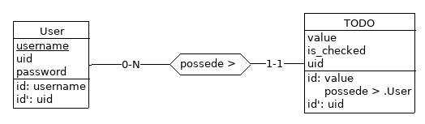

# Labo 2

Le but est de créer une API REST avec le framework
[django-rest-framework](django-rest-framework.org) implémentant une todolist.

- Chaque utilisateur possède ses propres todos (qui possèdent un champ
  texte `value` et un boolean `checked`). Les deux auront un
  identifiant secondaire `uuid`.

- Le système d'authentification utilisera les JSON WEB TOKEN via le
  plugin [django-rest-framework-simplejwt](https://github.com/SimpleJWT/django-rest-framework-simplejwt).

- Une documentation via [Swagger](https://www.django-rest-framework.org/topics/documenting-your-api/#documenting-your-api).

