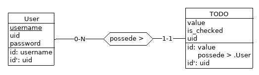

# Labo 2

Le but est de créer une API REST avec le framework
[django-rest-framework](django-rest-framework.org) implémentant une todolist.

- Chaque utilisateur possède ses propres todos (qui possèdent un champ
  texte `value` et un boolean `checked`). Les deux auront un
  identifiant secondaire `uuid`.

- Le système d'authentification utilisera les JSON WEB TOKEN via le
  plugin [django-rest-framework-simplejwt](https://github.com/SimpleJWT/django-rest-framework-simplejwt).

- Une documentation via [Swagger](https://www.django-rest-framework.org/topics/documenting-your-api/#documenting-your-api).

- Utilisation d'un classe User personnalisée pour lui ajouter des
  attributs, voir [`AbstractUser`](https://docs.djangoproject.com/fr/3.1/topics/auth/customizing/#substituting-a-custom-user-model).

- Chaque utilisateur doit pouvoir réaliser des opérations `CRUD` sur
  ses todos.

    - `GET /todos`: liste les todos
    - `GET /todo/<uid>`: affiche le todo dont l'uid est `uid`
    - `POST /todos`: ajoute un todo
    - `PATCH /todo/<uid>`: modifie le todo dont l'uid est `uid`
    - `DELETE /todo/<uid>`: supprime le todo dont l'uid est `uid`

